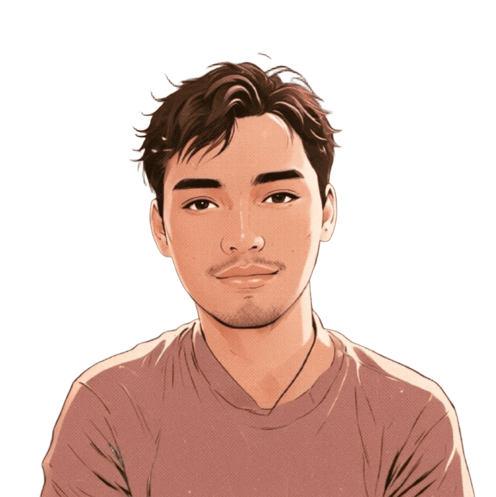
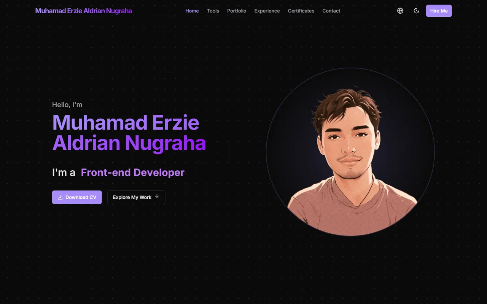
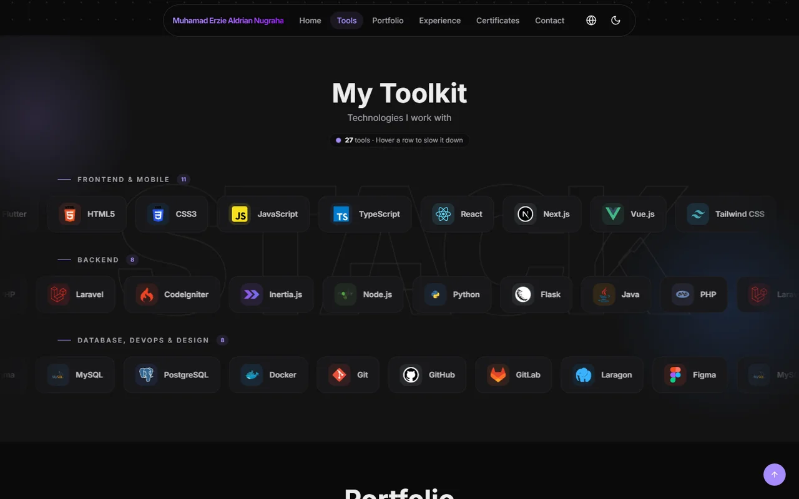
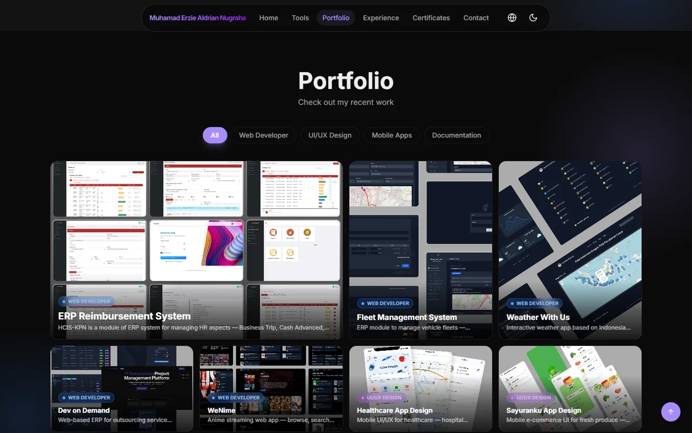
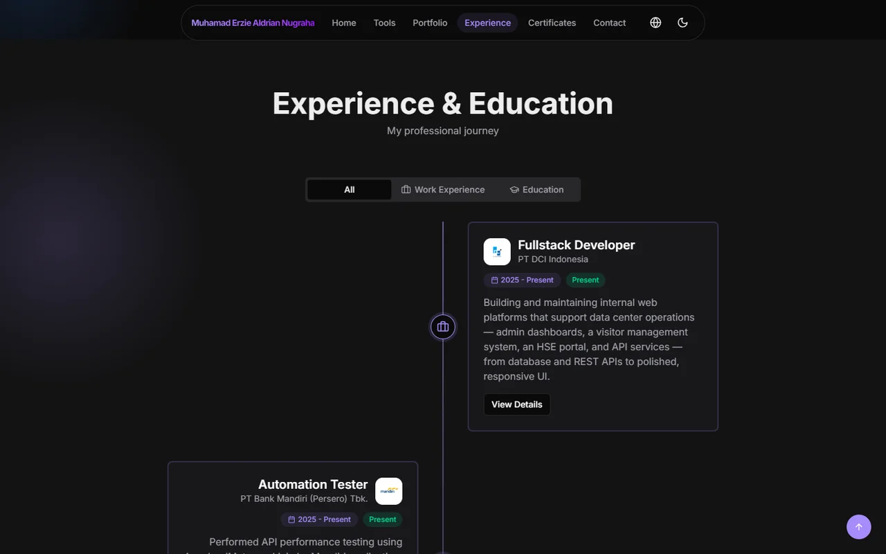
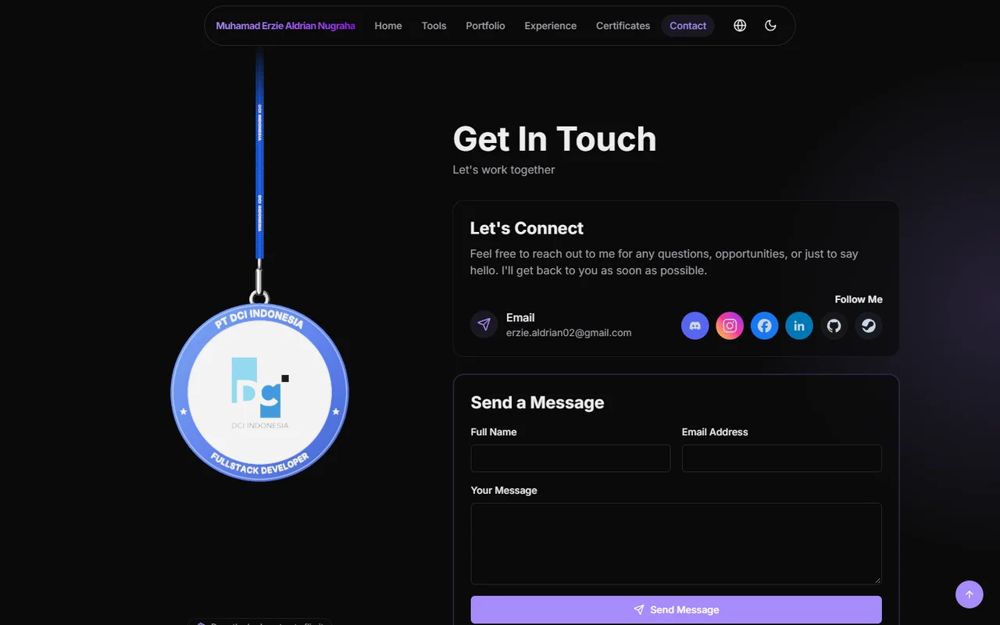
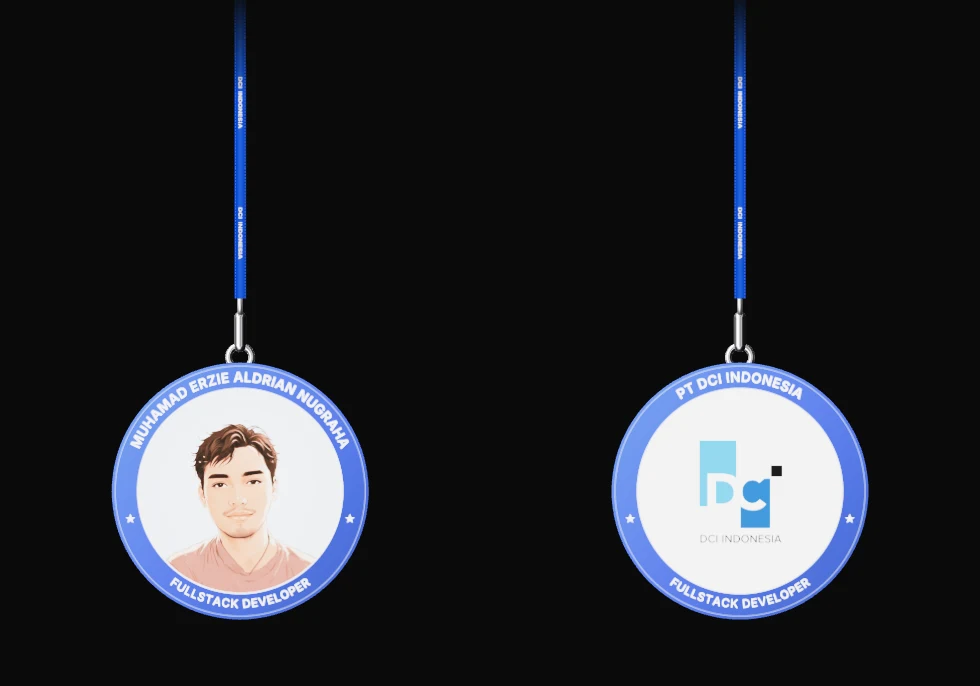
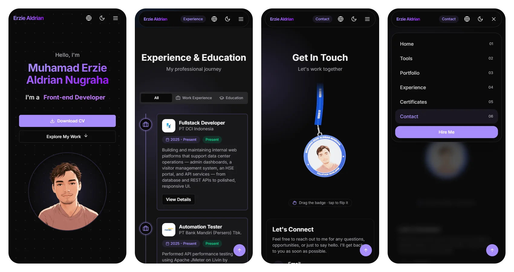
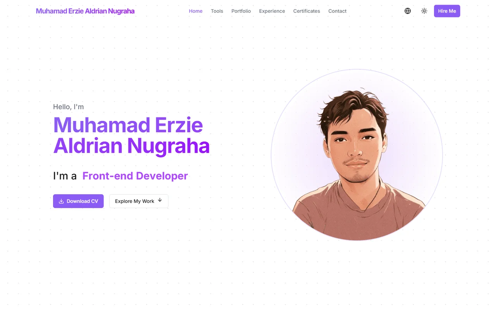

<div align="center">



# Muhamad Erzie Aldrian Nugraha — Portfolio

**Fullstack Developer · UI/UX Designer**

My personal portfolio: projects, experience, certificates, and a way to get in touch.
Built with Next.js 15, React 19, Tailwind CSS v4, Framer Motion, and React Three Fiber.

[](https://erziealdrian02.github.io/)
[](https://www.linkedin.com/in/muhamad-erzie-aldrian-nugraha/)


</div>

<br />

<p align="center">
  
</p>

## ✨ Highlights

- **Interactive 3D lanyard badge.** A physics-driven badge (React Three Fiber + Rapier) hangs next to the contact form. Drag it around, or tap it to flip between my portrait and the PT DCI Indonesia logo.
- **Parallax scrolling.** The hero text, portrait, and background glows move at different speeds as you scroll.
- **Living toolkit.** Three marquee rows (27 technologies) react to scroll speed and slow down on hover.
- **Bento-grid portfolio.** Projects can be filtered by category, and each one opens a gallery with live, code, and Figma links.
- **Experience timeline.** Work and education history, with a detail view for each role.
- **Three languages.** English, Bahasa Indonesia, and 日本語.
- **Light and dark themes,** following the system preference.
- **Mobile-first.** On phones you get a hamburger menu, swipeable carousels, and a timeline that fits small screens.
- **Built for performance.** Images are served as WebP, canvases only redraw when something changes, animations pause off-screen, and three.js loads only when the contact section comes into view.

## 📸 Screenshots

<table>
  <tr>
    <td width="50%"><p align="center"><sub>Toolkit: scroll-reactive marquee</sub></p></td>
    <td width="50%"><p align="center"><sub>Portfolio: bento grid with filters</sub></p></td>
  </tr>
  <tr>
    <td width="50%"><p align="center"><sub>Experience & education timeline</sub></p></td>
    <td width="50%"><p align="center"><sub>Contact with the 3D lanyard</sub></p></td>
  </tr>
</table>

### 🪪 Lanyard: front & back

<p align="center">
  
</p>

### 📱 Mobile

<p align="center">
  
</p>

### ☀️ Light mode

<p align="center">
  
</p>

## 🧰 Tech Stack

| Area | Tools |
| --- | --- |
| Framework | [Next.js 15](https://nextjs.org) (App Router, static export), React 19, TypeScript |
| Styling | Tailwind CSS v4, Radix UI primitives, `class-variance-authority` |
| Animation | Framer Motion (scroll-linked parallax, marquee, transitions) |
| 3D / Physics | three.js, `@react-three/fiber`, `@react-three/drei`, `@react-three/rapier`, `meshline` |
| Email | Nodemailer (Gmail SMTP) via a Next.js route handler |
| Analytics | Vercel Analytics & Speed Insights |

## 📁 Project Structure

```
src/
├── app/
│   ├── api/send-email/      # Contact form handler (Nodemailer)
│   ├── globals.css          # Theme tokens + shared animations
│   ├── layout.tsx
│   └── page.tsx             # Section composition
├── components/
│   ├── sections/            # hero, tools, portfolio, experience, certificates, contact
│   ├── ui/                  # lanyard, parallax, scroll-velocity, dot-grid, dialog, ...
│   └── navbar.tsx           # Desktop pill nav + mobile menu
├── hooks/                   # use-translation, use-toast, ...
├── lib/                     # certificate data, utils
└── translations/            # en.json, id.json, ja.json
public/
├── images/                  # profile, company, portfolio, certificates
└── resume/                  # downloadable CV
scripts/
└── optimize-images.mjs      # PNG/JPG → compressed WebP
```

## 🚀 Getting Started

**Requirements:** Node.js 18.18 or newer.

```bash
git clone https://github.com/erziealdrian02/erziealdrian02.github.io.git
cd erziealdrian02.github.io
npm install
npm run dev
```

Then open [http://localhost:3000](http://localhost:3000).

### Environment variables (contact form)

Create a `.env.local` file in the project root:

```env
EMAIL_USER=your-gmail@gmail.com
EMAIL_PASS=your-gmail-app-password
EMAIL_TO=where-messages-go@example.com
```

> `EMAIL_PASS` must be a Gmail [App Password](https://support.google.com/accounts/answer/185833), not your normal password.
> The form posts to `/api/send-email`, which needs a Node.js runtime such as Vercel. It does not run on GitHub Pages, which only serves static files.

### Scripts

| Command | Description |
| --- | --- |
| `npm run dev` | Start the dev server (Turbopack) |
| `npm run build` | Build a static export into `out/` |
| `npm run start` | Serve the production build |
| `npm run lint` | Run ESLint |
| `npm run deploy` | Build and publish `out/` to the `master` branch (GitHub Pages) |
| `node scripts/optimize-images.mjs` | Create compressed `.webp` copies of large images |

## ✏️ Customising

- **Projects:** edit the `projects` array in `src/components/sections/portfolio-section.tsx`.
- **Experience:** edit the `experiences` array in `src/components/sections/experience-section.tsx`.
- **Toolkit:** add an entry to `frontendTools`, `backendTools`, or `infraTools` in `src/components/sections/tools-section.tsx`.
- **Certificates:** edit `src/lib/certificate-data.ts`.
- **Text & translations:** edit `src/translations/{en,id,ja}.json`.
- **Lanyard:** change the `frontImage`, `backImage`, `name`, `role`, and `company` props of `<Lanyard />` in `contact-section.tsx`.

After adding large images, run `node scripts/optimize-images.mjs` and point the components at the generated `.webp` files.

## 🙏 Credits

- The lanyard is adapted from [React Bits: Lanyard](https://reactbits.dev/components/lanyard).
- Icons come from [Lucide](https://lucide.dev), [Devicon](https://devicon.dev), and [SVG Repo](https://www.svgrepo.com).

## 📬 Contact

- **Email:** [erzie.aldrian02@gmail.com](mailto:erzie.aldrian02@gmail.com)
- **LinkedIn:** [muhamad-erzie-aldrian-nugraha](https://www.linkedin.com/in/muhamad-erzie-aldrian-nugraha/)
- **GitHub:** [@erziealdrian02](https://github.com/erziealdrian02)

<div align="center"><sub>© 2026 Muhamad Erzie Aldrian Nugraha</sub></div>
